# Survey Analysis - Life of Data Scientists

It was my first 'real world' Data Analysis Project. While on my journey toward mastering the "Data Analysts' Toolkit", I was curious to analyze a real world dataset. Just then, I happened to see a 'survey analysis' challenge in Linkedin. 'Saturn Cloud' has surveyed Data Scientists across the industry to gather insights, and has asked whoever interested to analyze the survey data and uncover insights. The goal was to develop an one-page data visualization that tells the story of the insight. It was the perfect place to start my 'work'.

## Data Cleaning and Analysis
'Saturn Cloud' was kind enough to share the Survey Results as a CSV file. The survey had 23 questions. Hundreds of Data Scientists have participated in the survey.

I decided to use the good old Ms.Excel for my analysis. Pivot Tables were my best friend. After cleaning and analyzing the raw data, the insights in the data became evident.

## Are you running on-premises or on a Cloud Provider?
AWS(35%), On-premises(28%), Google Cloud(16%), Azure(13%) and Others(8%)
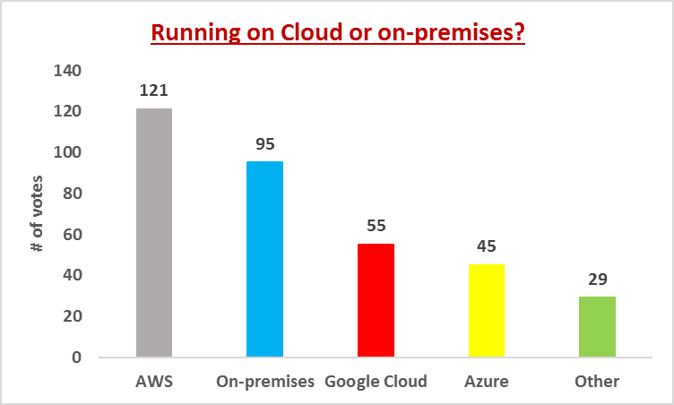

## How much of your Data Analytics and Machine Learning development is done using Python & PyData stack?Mostly Python(74%), Some Python(20% ), No Python(5% ), Currently no Python but have plans for Python in the future(1%)
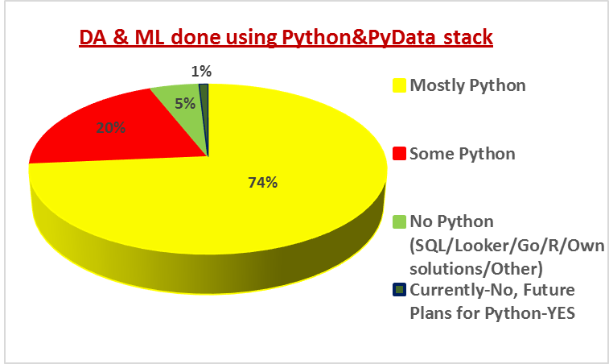

## What development tools (Jupyter/IDEs) and ML packages are you using?
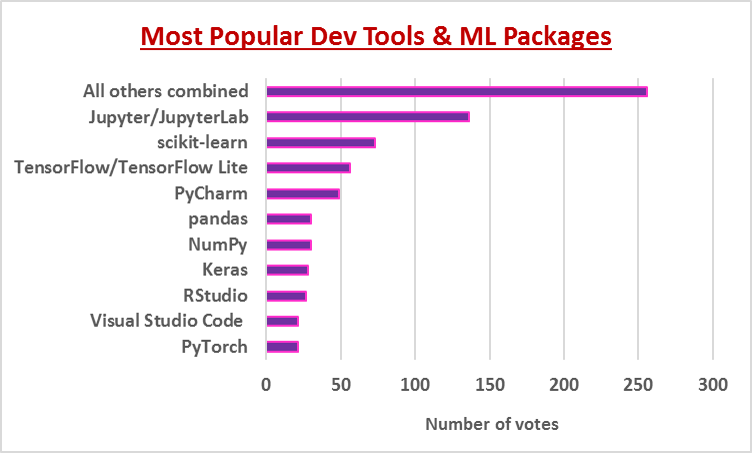

## Is your Data Science team currently using tools that they're not totally comfortable with?

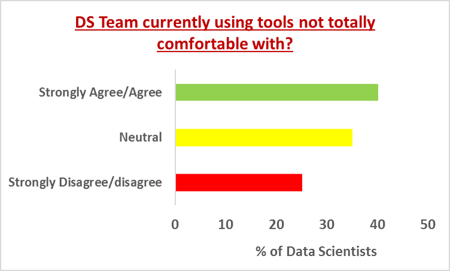

## How do you deploy your data analyses and ML models?

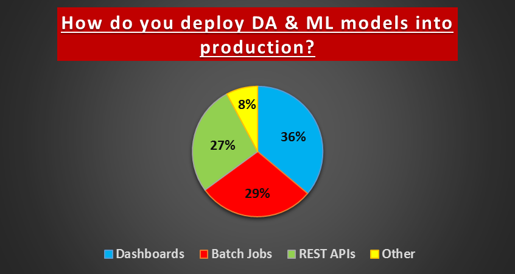
              

## Where is your data stored?

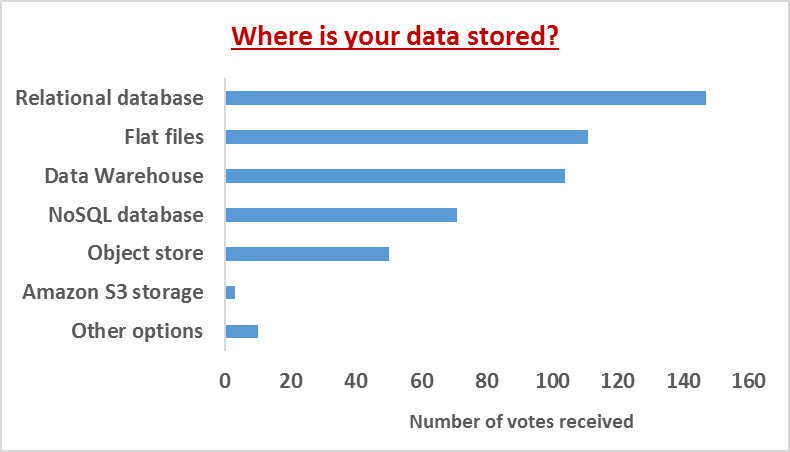
 

## Who deploys your data analyses and ML models today?

 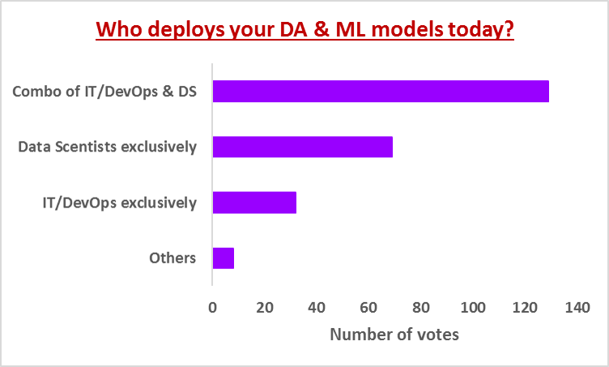

## Would an orchestration product like Airflow be useful? (workflow automation (like cron) but with support for job dependencies) If so, how?
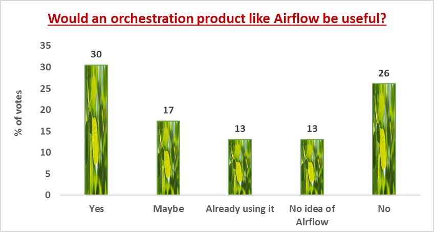

## Rate your current pipeline or workflow from data acquisition to development to deployment today.
Many Data Scientists find their current pipeline complex. So, there’s a market need there for better products
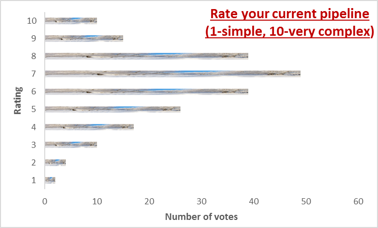

## Would you like to add automation to your pipeline?
Most are in favor of automation

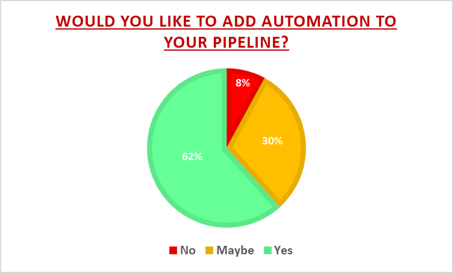

## Do analysts and data scientists work alone or collaborate?

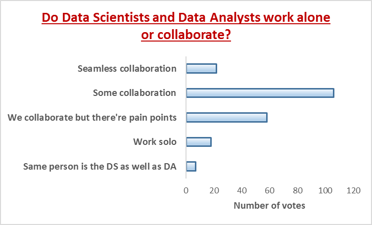

## Is there a desire to collaborate more?
Majority of the DSs agree

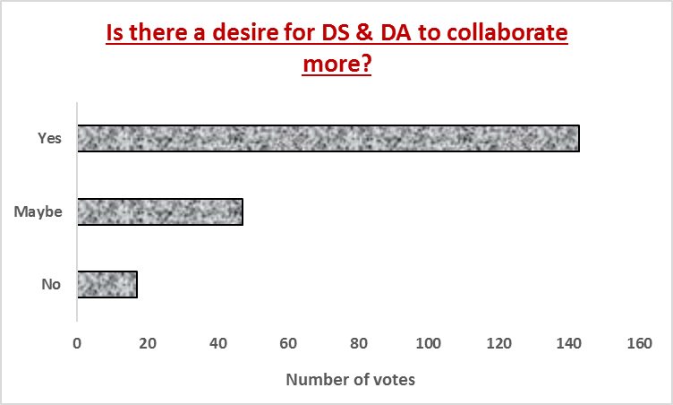

## Are your data scientists using Git?
More than 50% of all the DSs surveyed are proficient in Git, while some are not that comfortable
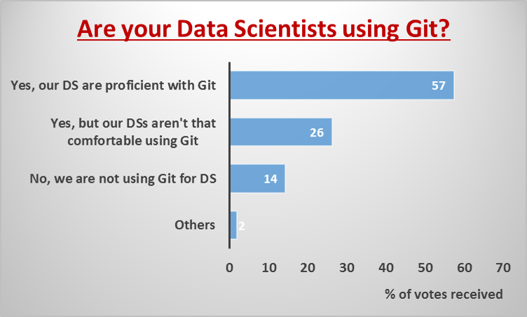

## Do IT/DevOps/SE teams rewrite data scientists' code?

They typically don't, and that is great!

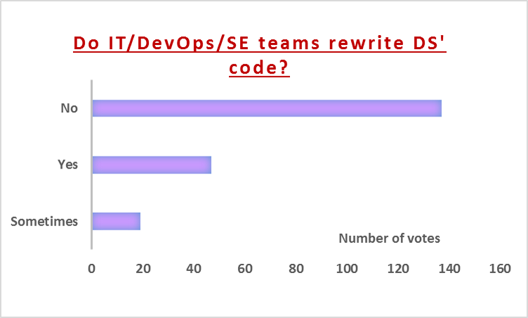

## Is reproducing older results a requirement, for compliance or other reasons?
Yes, to a great extent!

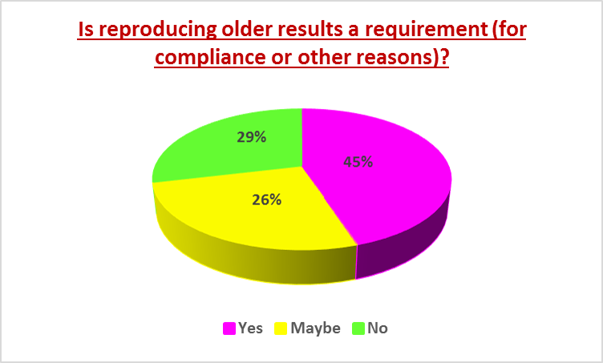

## Do you use the following:
A huge count of DSs use neither Dask nor RAPIDS, however DSs seem pretty familiar with Dask rather than with RAPIDS

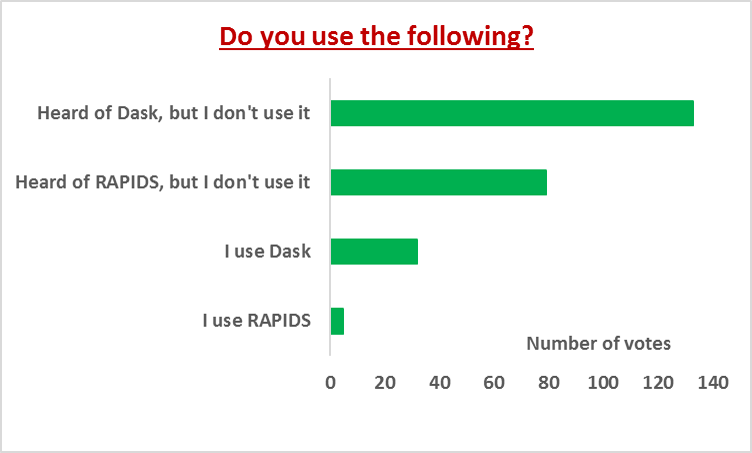

## On a scale of 0 to 10, 10 being highly likely and 0 being not at all likely, how likely are you to recommend Spark to a friend or colleague?
Majority of the Spark using DSs would recommend it.

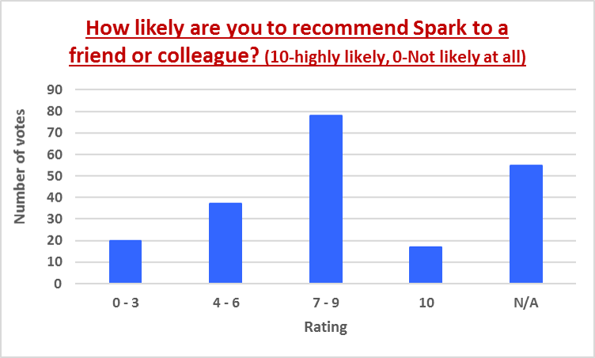

## Which best describes your attitude toward cloud compute costs?

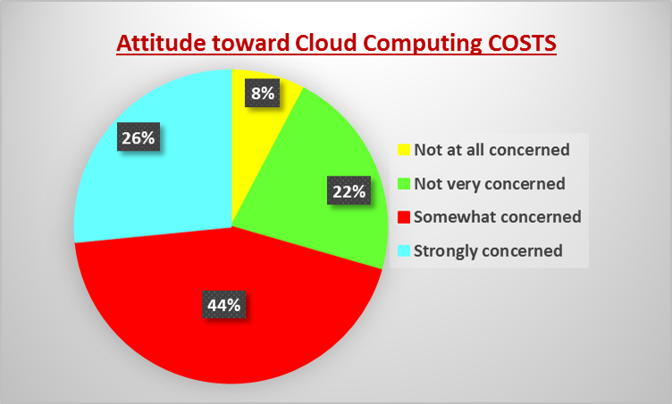

## Are you currently purchasing software or other services through any of the following marketplaces:
We have more Data Scientists buying through various cloud marketplaces (58% - AWS, Azure, GCP & others put together), compared to Data Scientists who don’t(42%).

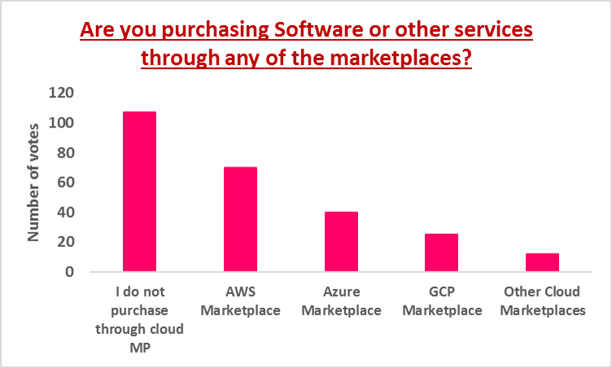

## Key Takeaways:
There are problems that Data Scientists face in the area of automation, workflow, deployment and collaboration. Solutions in these areas, if offered could create great opportunities for Saturn Cloud.

Did anything come as a surprise? Do you think any of these trends are expected to change soon? Your thoughts/insights/predictions are very welcome! :)

